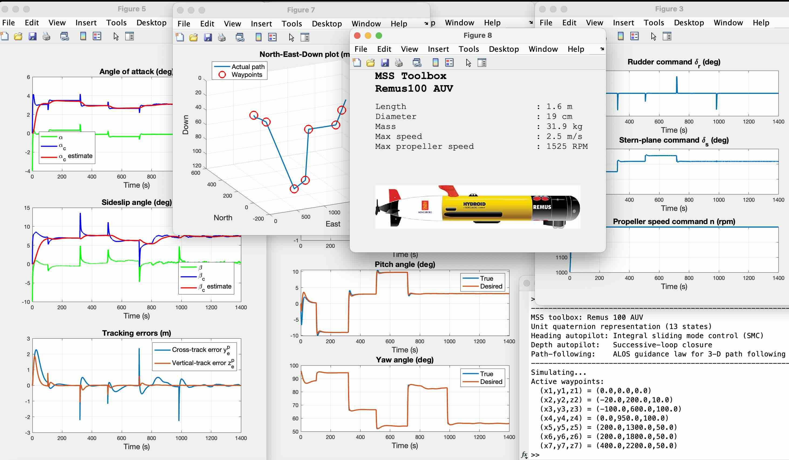

# MSS (Marine Systems Simulator)

The Marine Systems Simulator (MSS) is a Matlab and Simulink library (www.mathworks.com) for marine control systems design. The m-files are compatible with the free software GNU Octave (www.octave.org). MSS includes models for ships, underwater vehicles, uncrewed surface vehicles, and floating structures. The library also contains guidance, navigation, and control (GNC) blocks for time-domain simulation. Hydrodynamic modeling and the GNC algorithms are described in:

    T. I. Fossen (2021). Handbook of Marine Craft Hydrodynamics and Motion Control. 2nd. Edition, Wiley. ISBN-13: 978-1119575054

The lecture notes https://wiley.fossen.biz serve as documentation for the toolbox. Please include the following reference when using the MSS libraries: 

    T. I. Fossen and T. Perez (2004). Marine Systems Simulator (MSS)
    URL: https://github.com/cybergalactic/MSS

### Installation

- [How to install MSS for MATLAB](How%20to%20install%20MSS%20for%20MATLAB.md)  
  You can update an existing path automatically and remove dead links using the command 'mssPath'.
- [How to install MSS for GNU Octave](How%20to%20install%20MSS%20for%20GNU%20Octave.md)  
  To update an existing path and remove dead links, the old path in the startup file (https://docs.octave.org/latest/Startup-Files.html) must be deleted before a new path with subfolders is saved under GNU Octave.

### Get Started

To get started and find help on using the MSS, type the following command in the MATLAB command window:

    mssHelp

Marine craft models and time-series simulation templates (m-files) are located under the catalog:

    /MSS/VESSELS/                           Marine craft model library and scripts for time-domain simulation

and the m-files can be listed by typing

    help VESSELS                            Marine craft models and time-series simulation templates (m-files)

Figure 1. The user-editable script 'SIMremus100.m' is used to simulate the Remus 100 AUV ('remus100.m') during 3-D path following.

Examples and demo files are located under the catalogs: 

    /MSS/mssExamples/                       Textbook m-file examples (Fossen 2021)  
    /MSS/mssDemos/                          MSS m-file demos
    /MSS/SIMULINK/mssSimulinkDemos/         Simulink demos  
    /MSS/SIMULINK/mssWamitShipXTemplates/   Simulink templates for simulation of WAMIT and ShipX vessel and RAO data
    
The Simulink library is loaded by typing:

    mssSimulink  

 GNC Library
-

Basic libraries and system examples for GNC. The library contains:

- M-file functions (kinematics and kinetics) and examples for time-domain GNC applications.
- M-file library with vessel models, maneuvering trials, and dynamic simulation.
- User-editable m-files for simulating and controlling marine craft, including ships, semisubmersibles, autonomous underwater vehicles (AUVs), remotely operated vehicles (ROVs), and uncrewed surface vehicles (USVs).

 INS Library
 -
 Functions and scripts for time-domain inertial navigation systems (INS) using unit quaternions and Euler angles. The library contains:
- User-editable m-files for implementation of error-state Kalman filters (ESKF).
- M-file library with aided INS functions.

 Hydro Library
-

The toolbox reads output data files generated by hydrodynamic programs and processes the data for use in Matlab. MSS Hydrodynamics includes several example vessels. To build your model, you need a license for one of the following programs:

- 2D strip theory programs - ShipX (Veres) by SINTEF OCEAN AS
- 3D potential theory programs - WAMIT by WAMIT Inc.

The processed data can be used in the real-time simulation of marine vessels in 6 DOFs exposed to 1st- and 2nd-order wave loads (motion and force RAO transfer functions) using the Simulink templates located under /MSS/SIMULINK/mssWamitShipXTemplates/.

FDI Toolbox
-
This is a stand-alone toolbox for identifying radiation-force models and fluid-memory effects of marine structures such as marine craft and wave energy converters. Please include the following reference when you use the MSS FDI toolbox:
 
    T. Perez and T. I. Fossen (2009). A Matlab Tool for Parametric Identification of Radiation-Force Models of Ships and Offshore Structures. 
    Modeling, Identification and Control, MIC-30(1):1-15. DOI: https://doi.org/10.4173/mic.2009.1.1 
