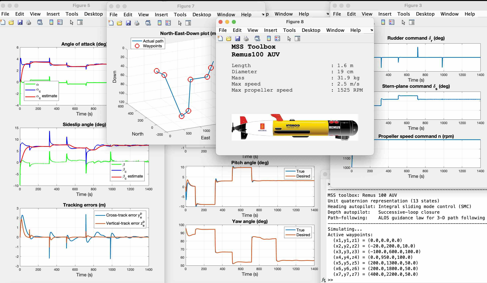

# MSS (Marine Systems Simulator)

The Marine Systems Simulator (MSS) is a MATLAB library (www.mathworks.com) for designing and testing marine control systems. The m-files are compatible with the free software GNU Octave (www.octave.org). MSS includes models for ships, underwater vehicles, uncrewed surface vehicles, and floating structures. The library also contains guidance, navigation, and control (GNC) functions for time-domain simulation.

### Release 2.0

This release substantially expands the CRAFT library with new vessel models and a unified workflow for building 6-DOF vessel models from seakeeping data generated by ShipX, WAMIT, and Capytaine. The new [`hydroVessel.m`](CRAFT/hydroVessel.m) function implements the 12-state, 6-DOF equations of motion, while the editable [`SIMhydroVessel.m`](CRAFT/SIMhydroVessel.m) simulator provides a reusable template for building a user-defined surface vessel, USV, AUV, or ship.

`SIMhydroVessel.m` includes a basic GUI for selecting the vessel and configuring the simulation. It supports irregular seas with selectable wave spectra and directional spreading, first-order wave forces computed from force RAOs, ocean currents, and either heading-autopilot or dynamic-positioning (DP) control.

ShipX and WAMIT are commercial programs. This release places particular emphasis on the open-source [MSS-Capytaine](https://github.com/cybergalactic/MSS-Capytaine) add-on, which connects MSS to the open-source Capytaine solver and provides a freely available workflow for generating hydrodynamic vessel models.

Legacy Simulink vessel templates have been removed. The Simulink library and demonstration models remain included.

Hydrodynamic modeling and the GNC algorithms are described in:

    T. I. Fossen (2027). Handbook of Marine Craft Hydrodynamics and Motion Control. 3rd Edition, Wiley (in progress).

The lecture notes https://wiley.fossen.biz serve as documentation for the toolbox.

### Recommended citation

When using this release, please cite the software as:

> Fossen, Thor I. (2026). *Marine Systems Simulator (MSS)* [Computer software]. GitHub. https://github.com/cybergalactic/MSS

```bibtex
@software{Fossen2026_MSS,
  author  = {Fossen, Thor I.},
  title   = {Marine Systems Simulator (MSS)},
  year    = {2026},
  url     = {https://github.com/cybergalactic/MSS}
}
```

For the original MSS development and historical background, use:

    T. I. Fossen and T. Perez (2004). Marine Systems Simulator (MSS)
    URL: https://github.com/cybergalactic/MSS

### Installation

- [How to install MSS for MATLAB](How%20to%20install%20MSS%20for%20MATLAB.md)  
  You can update an existing path automatically and remove dead links using the command 'mssPath'.
- [How to install MSS for GNU Octave](How%20to%20install%20MSS%20for%20GNU%20Octave.md)  
  To update an existing path and remove dead links, the old path in the startup file (https://docs.octave.org/latest/Startup-Files.html) must be deleted before a new path with subfolders is saved under GNU Octave.

### Get Started

To get started and find help on using the MSS, type the following command in the MATLAB command window:

    mssHelp

Craft models and editable time-domain simulation scripts are located under the catalog:

    /MSS/CRAFT/                            Craft model library and scripts for time-domain simulation

See the [CRAFT Library documentation](CRAFT/CRAFT-Library.md) for the available models, simulation scripts, and hydrodynamic-vessel workflow.


Figure 1. The user-editable script 'SIMremus100.m' is used to simulate the Remus 100 AUV ('remus100.m') during 3-D path following.

Examples and demo files are located under the catalogs: 

    /MSS/mssExamples/                       Textbook m-file examples (Fossen 2027)
    /MSS/mssDemos/                          MSS m-file demos
    /MSS/SIMULINK/mssSimulinkDemos/         Simulink demos

## GNC Library

The GNC library contains reusable functions for marine guidance, navigation, and feedback control, including:

- Two- and three-dimensional path-following guidance using line-of-sight (LOS), integral LOS (ILOS), and adaptive LOS (ALOS) methods.
- Straight-line waypoint paths, Hermite splines, hybrid paths, cross-track errors, and path-projection utilities.
- Navigation and attitude calculations, including a five-state GNSS extended Kalman filter and static roll, pitch, and yaw estimation from IMU measurements.
- Nonlinear MIMO PID control for dynamic positioning, integral sliding-mode heading control, and linear-quadratic tracking.
- Control allocation, command and reference models, LOS command filtering, and saturation utilities.

See the [GNC Library documentation](GNC/GNC-Library.md) for a categorized function overview.

## INS Library

The INS library contains user-editable functions and simulation examples for inertial navigation and attitude estimation, including:

- Aided error-state Kalman filters (ESKFs) using Euler-angle or unit-quaternion attitude representations.
- Multiplicative extended Kalman filters (MEKFs) for quaternion attitude and aided INS estimation.
- A nonlinear Mahony–Hamel–Pflimlin (MHP) quaternion attitude observer with angular-rate sensor bias estimation.
- Position-, velocity-, compass-, magnetometer-, AHRS-, and pressure-aided navigation examples, including heave estimation.
- IMU test-signal generation and gravity and magnetic-field reference models.

See the [INS Library documentation](INS/INS-Library.md) for the available simulations and supporting functions.

## HYDRO Library

The toolbox reads output files generated by seakeeping programs and processes the data for use in MATLAB or GNU Octave. MSS Hydrodynamics includes several example vessels and supports data from:

- ShipX (Veres), a commercial 2D strip-theory program by SINTEF OCEAN AS
- WAMIT, a commercial 3D potential-flow program by WAMIT Inc.
- [Capytaine](https://capytaine.org/), an open-source 3D potential-flow boundary-element solver, through the [MSS-Capytaine](https://github.com/cybergalactic/MSS-Capytaine) Python add-on

ShipX and WAMIT require commercial licenses. Capytaine is free and open source and is installed separately as a Python dependency of MSS-Capytaine. Pre-generated Capytaine cases for the synthetic [testShip](HYDRO/vessels_capytaine/testShip/Test-Ship.md) and submerged [LAUV_marie](HYDRO/vessels_capytaine/LAUV_marie/LAUV-Marie.md) are included and can be used directly in MATLAB or GNU Octave without installing Python.

The processed data use the common MSS `vessel` structure. The editable [SIMhydroVessel.m](CRAFT/SIMhydroVessel.m) script uses this structure for time-domain simulation of 6-DOF maneuvering, control, ocean currents, and first-order wave loads. Capytaine cases take their default linear viscous-damping inputs from `vessel.powerBased`, as exported from their MSS-Capytaine JSON configurations. Optional commented overrides are provided in `hydroVesselConfig.m`; WAMIT and ShipX retain active defaults there because their current vessel files do not store these inputs.

Example data and processing instructions are organized by source:

- [ShipX vessel data](HYDRO/vessels_shipx/ShipX-Vessels.md)
- [WAMIT vessel data](HYDRO/vessels_wamit/WAMIT-Vessels.md)
- [Capytaine vessel data](HYDRO/vessels_capytaine/Capytaine-Vessels.md)

See the [HYDRO Library documentation](HYDRO/HYDRO-Library.md) for the complete data-processing and simulation workflow.

## FDI Toolbox

This is a stand-alone toolbox for identifying radiation-force models and fluid-memory effects of marine structures such as marine craft and wave energy converters. Please include the following reference when you use the MSS FDI toolbox:
 
    T. Perez and T. I. Fossen (2009). A Matlab Tool for Parametric Identification of Radiation-Force Models of Ships and Offshore Structures. 
    Modeling, Identification and Control, MIC-30(1):1-15. DOI: https://doi.org/10.4173/mic.2009.1.1 

See the [FDI Toolbox documentation](FDI/FDI-Toolbox.md) for demonstrations, functions, and documentation.

## General Library

The [MSS General Library documentation](LIBRARY/General-Library.md) describes the reusable modeling, kinematics, environmental, maneuvering, numerical, filtering, and motion-sickness functions.
